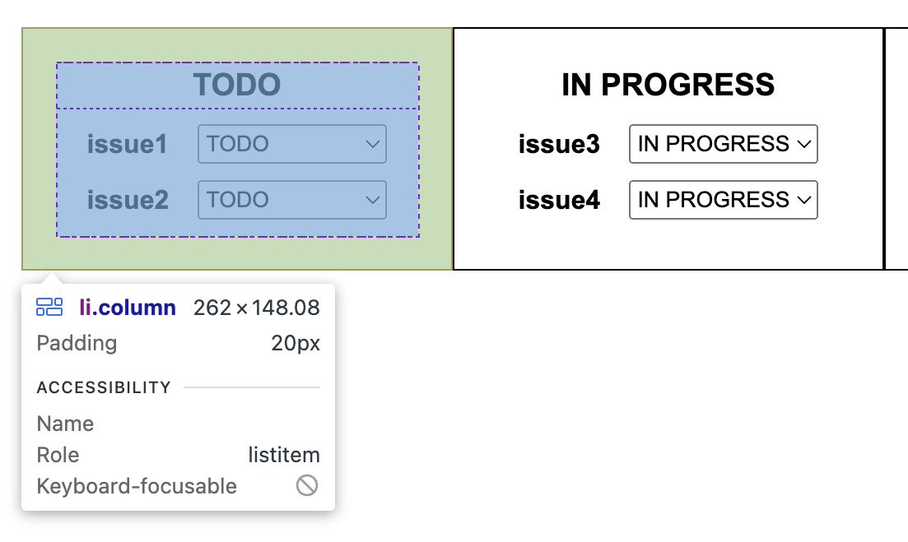

# TodoList 프로젝트

## 목차

1. [프로젝트 개요](#프로젝트-개요)
2. [파일 구조](#파일-구조)
3. [프로젝트 실행 방법](#프로젝트-실행-방법)
4. [참고 사항](#참고-사항)

## 프로젝트 개요

작성 예정

## 파일 구조

```
.
├── README.md
├── index.html
├── package-lock.json
├── package.json
├── src
│   ├── App.jsx
│   ├── components
│   │   ├── Board
│   │   │   ├── Board.css
│   │   │   └── Board.jsx
│   │   ├── Column
│   │   │   ├── Column.css
│   │   │   └── Column.jsx
│   │   └── Issue
│   │       ├── Issue.css
│   │       └── Issue.jsx
│   ├── constants
│   │   └── issueTypes.js
│   ├── data
│   │   └── issues.js
│   ├── main.jsx
│   └── styles
│       └── reset.css
└── vite.config.mjs
```

## 프로젝트 실행 방법

1. **레포지토리 클론**

   ```bash
   git clone https://github.com/dltkdgus482/TodoList.git
   ```

2. **디렉토리 이동**

   ```bash
   cd TodoList
   ```

3. **필요한 패키지 설치**

   ```bash
   npm install
   ```

4. **개발 서버 실행**
   ```bash
   npm run dev
   ```

- 개발 서버 실행 후 브라우저에서 [http://localhost:5173](http://localhost:5173)을 열어 프로젝트를 확인하세요.
- Node.js가 설치되어 있지 않은 경우, [Node.js 설치](https://nodejs.org/) 후 다시 시도하세요.

## 참고 사항

### 1. **Bundler로 Vite를 선택한 이유**

### 2. **Reset CSS 적용 전후 비교**

- Reset CSS를 적용하기 전 아래의 사진과 같이 브라우저마다 UI가 다른 문제가 발생

<table> <thead> <tr> <th>Reset CSS 적용 전 (Chrome)</th> <th>Reset CSS 적용 후 (Chrome)</th> </tr> </thead> <tbody> <tr> <td>  </td> <td>  </td> </tr> <tr> <th>Reset CSS 적용 전 (Safari)</th> <th>Reset CSS 적용 후 (Safari)</th> </tr> <tr> <td>  </td> <td>  </td> </tr> </tbody> </table>

### 3. **Unit Test**

- Unit Test를 위해 Jest Library를 활용
